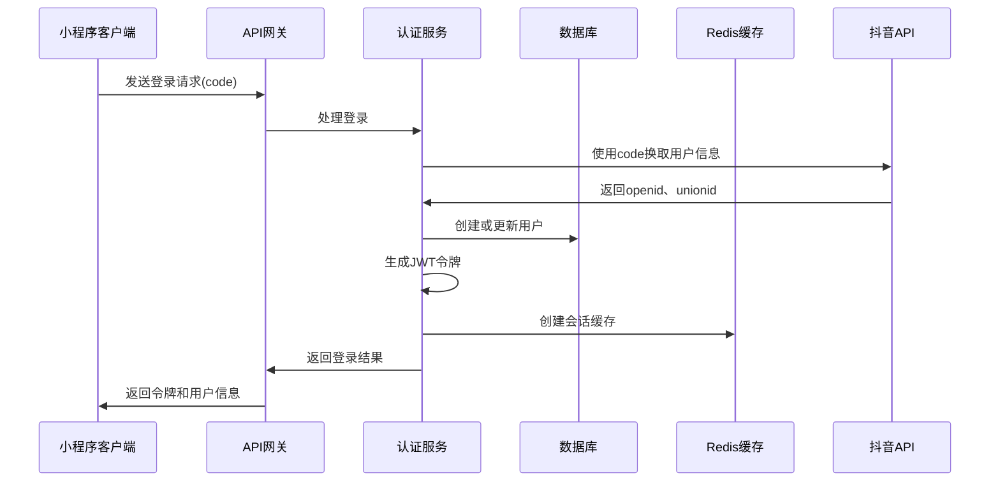
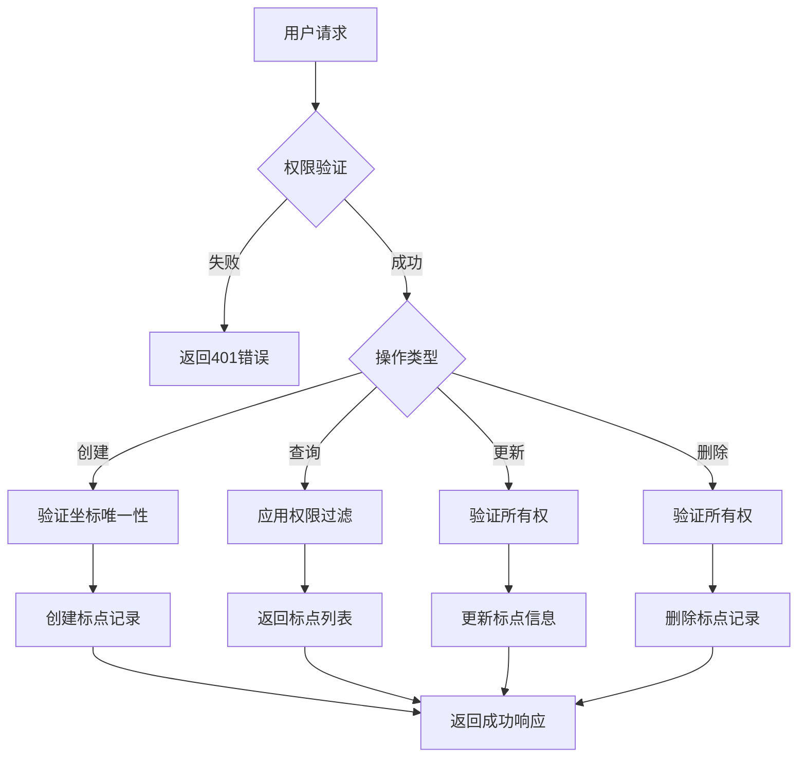
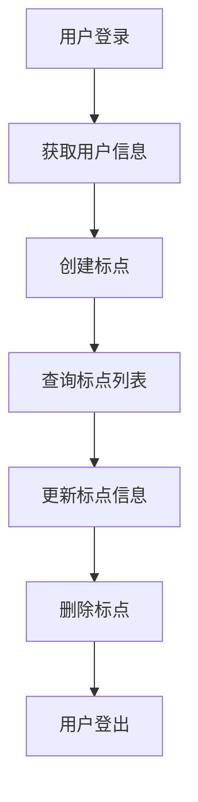

# 功能迁移设计文档

## 概述

本设计文档旨在将 dyxr 项目中的核心功能迁移到 dwxr_backend 中实现。dyxr 是一个基于 FastAPI 的抖音小程序登录后端服务，支持用户管理、会话管理和标点信息管理。通过系统性的功能迁移，我们将统一后端架构，提升系统的可维护性和扩展性。

### 迁移目标

- 将 dyxr 的抖音小程序登录功能集成到 dwxr_backend
- 迁移用户管理和标点信息管理功能
- 保持现有的认证和会话管理机制
- 统一 API 设计风格和数据模型规范
- 确保业务逻辑的完整性和数据一致性

## 架构分析

### 源系统架构 (dyxr)

dyxr 项目采用标准的 FastAPI 项目结构，具有以下核心组件：

| 组件 | 描述 | 文件位置 |
|------|------|----------|
| 数据模型 | 用户模型、标点模型、登录日志 | models/ |
| API 路由 | 用户路由、抖音登录路由、标点路由 | routes/ |
| 业务服务 | 登录服务、用户服务、标点服务 | services/ |
| 数据验证 | Pydantic 模式定义 | schemas/ |
| 认证中间件 | JWT 认证、会话管理 | middleware/ |
| 工具类 | JWT 工具、HTTP 工具 | utils/ |

### 目标系统架构 (dwxr_backend)

dwxr_backend 采用现代化的 FastAPI 架构，具有以下特点：

| 组件 | 描述 | 文件位置 |
|------|------|----------|
| 统一模型 | SQLModel 数据模型 | app/models.py |
| API 路由 | RESTful API 设计 | app/api/routes/ |
| CRUD 操作 | 数据库操作抽象 | app/crud.py |
| 依赖注入 | FastAPI 依赖系统 | app/api/deps.py |
| 核心配置 | 应用配置管理 | app/core/ |
| 数据库 | Alembic 迁移管理 | app/alembic/ |

## 数据模型设计

### 用户模型迁移

将 dyxr 的用户模型适配到 dwxr_backend 的 SQLModel 架构：

| dyxr 字段 | dwxr_backend 字段 | 类型 | 说明 |
|-----------|-------------------|------|------|
| openid | openid | String(100) | 抖音用户唯一标识 |
| unionid | unionid | String(100) | 抖音开放平台统一标识 |
| name | name | String(100) | 用户昵称 |
| type | user_type | String(100) | 用户类型(normal/vip/admin) |
| quanxian | permission | String(100) | 用户权限(user/admin) |
| dengji | level | String(100) | 用户等级 |
| uuid | uuid | String(100) | 内部UUID标识 |
| avatar_url | avatar_url | String(500) | 头像URL |
| phone | phone | String(20) | 手机号 |
| status | is_active | Integer/Boolean | 用户状态 |

### 标点信息模型

标点信息管理功能的数据模型设计：

| 字段名 | 类型 | 约束 | 说明 |
|--------|------|------|------|
| bd_id | UUID | 主键 | 标点唯一标识 |
| latitude | String(100) | 非空 | 纬度 |
| longitude | String(100) | 非空 | 经度 |
| beizhu | String(100) | 可空 | 备注信息 |
| weather | String(100) | 可空 | 天气状况 |
| zhuangbei | String(100) | 可空 | 装备用饵 |
| type | Integer | 非空 | 钓鱼类型(1-台钓，2-路亚，3-其他) |
| yuhuo | String(100) | 可空 | 鱼获记录 |
| tuijian | String(100) | 非空 | 推荐指数 |
| simi | Integer | 非空 | 公开状态(0-私密，1-公开) |
| city | String(100) | 可空 | 城市 |
| province | String(100) | 可空 | 省份 |
| openid | String(100) | 外键 | 关联用户 |
| biaoti | String(100) | 可空 | 标题 |
| owner_id | UUID | 外键 | 关联 dwxr_backend 用户 |

### 登录日志模型

用户登录行为跟踪模型：

| 字段名 | 类型 | 说明 |
|--------|------|------|
| id | UUID | 主键 |
| openid | String(100) | 用户标识 |
| ip_address | String(50) | 登录IP |
| user_agent | String(500) | 用户代理 |
| login_result | Integer | 登录结果(1-成功，0-失败) |
| error_message | String(255) | 错误信息 |
| created_at | DateTime | 创建时间 |

## API 接口设计

### 抖音小程序登录接口

| 端点 | 方法 | 描述 | 请求体 | 响应 |
|------|------|------|--------|------|
| `/api/v1/douyin/login` | POST | 抖音小程序登录 | DouyinLoginRequest | DouyinLoginResponse |
| `/api/v1/douyin/refresh-token` | POST | 刷新令牌 | RefreshTokenRequest | RefreshTokenResponse |
| `/api/v1/douyin/logout` | POST | 用户登出 | 无 | LogoutResponse |

### 用户管理接口

| 端点 | 方法 | 描述 | 权限要求 |
|------|------|------|----------|
| `/api/v1/douyin/users/profile` | GET | 获取用户资料 | 用户认证 |
| `/api/v1/douyin/users/profile` | PUT | 更新用户资料 | 用户认证 |
| `/api/v1/douyin/users` | GET | 获取用户列表 | 管理员权限 |
| `/api/v1/douyin/users/{user_id}` | DELETE | 删除用户 | 管理员权限 |

### 标点信息管理接口

| 端点 | 方法 | 描述 | 权限要求 |
|------|------|------|----------|
| `/api/v1/biaodian` | GET | 获取标点列表 | 用户认证 |
| `/api/v1/biaodian` | POST | 创建标点 | 用户认证 |
| `/api/v1/biaodian/{bd_id}` | GET | 获取标点详情 | 用户认证 |
| `/api/v1/biaodian/{bd_id}` | PUT | 更新标点 | 用户认证 |
| `/api/v1/biaodian/{bd_id}` | DELETE | 删除标点 | 用户认证 |
| `/api/v1/biaodian/public` | GET | 获取公开标点 | 无需认证 |

## 业务逻辑层设计

### 抖音登录服务

抖音小程序登录业务流程：

### 用户会话管理

会话管理采用 JWT + Redis 双重机制：

| 组件 | 作用 | 存储内容 |
|------|------|----------|
| JWT Token | 无状态认证 | 用户标识、过期时间 |
| Redis Session | 状态管理 | 用户详细信息、权限数据 |

### 标点信息管理

标点信息的创建、查询、更新流程：

## 认证与授权

### JWT 认证机制

认证流程设计：

| 步骤 | 描述 | 实现组件 |
|------|------|----------|
| 1 | 用户提交 code | 抖音登录服务 |
| 2 | 调用抖音 API 验证 | HTTP 客户端 |
| 3 | 生成 JWT 令牌 | JWT 工具类 |
| 4 | 创建 Redis 会话 | 会话管理器 |
| 5 | 返回认证结果 | API 响应 |

### 权限控制

权限分级管理：

| 权限级别 | 权限范围 | 可访问功能 |
|----------|----------|------------|
| user | 普通用户 | 个人信息管理、标点CRUD |
| admin | 管理员 | 用户管理、所有标点管理 |
| superuser | 超级管理员 | 系统配置、用户权限管理 |

## 中间件与拦截器

### 认证中间件

用户认证状态验证：

| 功能 | 描述 | 实现方式 |
|------|------|----------|
| Token 验证 | 验证 JWT 令牌有效性 | 依赖注入 |
| 会话检查 | 检查 Redis 会话状态 | 中间件 |
| 权限校验 | 验证用户操作权限 | 装饰器 |

### 请求日志中间件

记录 API 访问日志：

| 记录内容 | 说明 |
|----------|------|
| 请求 ID | 唯一标识请求 |
| 用户信息 | 认证用户标识 |
| 访问路径 | API 端点 |
| 响应状态 | HTTP 状态码 |
| 处理时间 | 请求耗时 |

## 数据迁移策略

### 用户数据迁移

从 dyxr 到 dwxr_backend 的用户数据映射：

| 迁移步骤 | 描述 | 注意事项 |
|----------|------|----------|
| 1 | 导出 dyxr 用户数据 | 保持数据完整性 |
| 2 | 字段映射转换 | 适配新的模型结构 |
| 3 | 创建关联关系 | 与现有用户系统整合 |
| 4 | 验证数据一致性 | 确保迁移成功 |

### 标点数据迁移

标点信息的迁移处理：

| 处理方式 | 说明 |
|----------|------|
| 批量导入 | 使用脚本批量迁移历史数据 |
| 增量同步 | 迁移期间的新增数据处理 |
| 数据验证 | 迁移后的数据完整性检查 |

## 配置管理

### 抖音小程序配置

| 配置项 | 描述 | 环境变量 |
|--------|------|----------|
| APP_ID | 抖音小程序应用ID | DOUYIN_APP_ID |
| APP_SECRET | 抖音小程序密钥 | DOUYIN_APP_SECRET |
| AUTH_URL | 抖音认证接口地址 | DOUYIN_AUTH_URL |

### 会话配置

| 配置项 | 默认值 | 说明 |
|--------|--------|------|
| JWT_EXPIRE_MINUTES | 120 | JWT 令牌过期时间(分钟) |
| SESSION_EXPIRE_SECONDS | 7200 | Redis 会话过期时间(秒) |
| REFRESH_THRESHOLD | 1800 | 令牌刷新阈值(秒) |

## 测试策略

### 单元测试

测试覆盖范围：

| 测试类别 | 测试内容 | 工具 |
|----------|----------|------|
| 模型测试 | 数据模型验证 | Pytest |
| 服务测试 | 业务逻辑测试 | Mock |
| API 测试 | 接口功能测试 | TestClient |
| 认证测试 | 权限控制测试 | JWT Mock |

### 集成测试

端到端测试流程：

