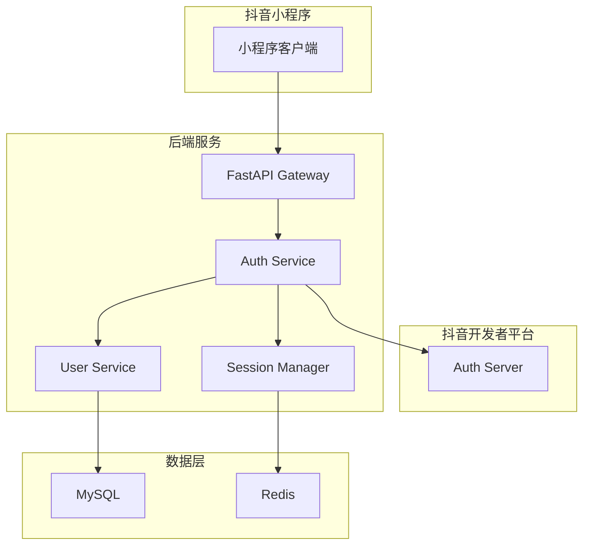
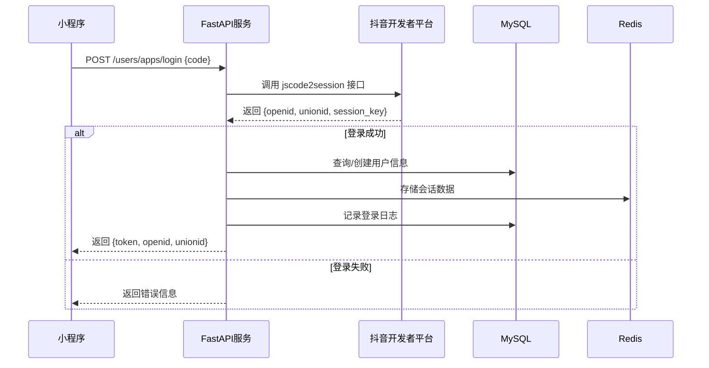
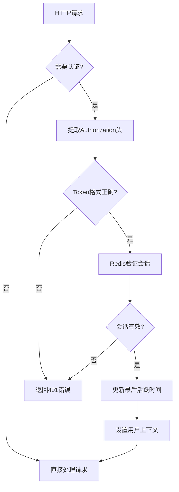
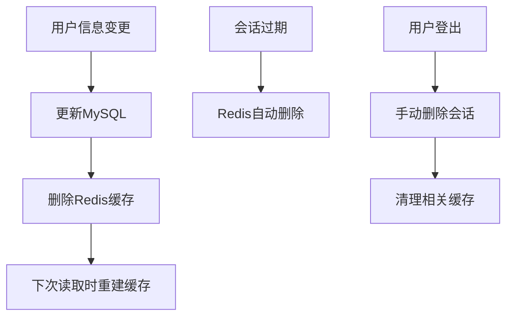

# 抖音小程序登录后端设计文档

## 1. 概述

本设计旨在构建一个基于FastAPI的抖音小程序登录后端服务，实现用户身份认证、会话管理和用户信息存储。系统采用MySQL存储持久化用户数据，Redis缓存热点数据，提供高性能、可扩展的登录解决方案。

### 1.1 核心功能
- 抖音小程序授权登录
- 用户信息管理和存储
- 会话令牌管理
- 用户数据缓存
- 登录状态验证

### 1.2 技术选型
- **后端框架**: FastAPI 0.115.12
- **数据库**: MySQL (持久化存储)
- **缓存**: Redis (会话和热点数据)
- **ORM**: SQLAlchemy 2.0.17
- **认证**: 抖音开发者平台 OAuth 2.0
- **数据验证**: Pydantic 1.10.9

## 2. 系统架构

### 2.1 整体架构图



### 2.2 分层架构

| 层级 | 组件 | 职责 |
|------|------|------|
| 接口层 | FastAPI Routes | HTTP请求处理、参数验证、响应格式化 |
| 业务层 | Services | 业务逻辑处理、第三方API调用 |
| 数据层 | Models | 数据模型定义、ORM映射 |
| 缓存层 | Redis Client | 会话管理、热点数据缓存 |
| 持久层 | MySQL | 用户数据持久化存储 |

## 3. API 端点设计

### 3.1 登录相关接口

#### 3.1.1 小程序登录
```
POST /users/apps/login
Content-Type: application/json

Request Body:
{
  "code": "string"  // 小程序调用 tt.login() 获取的临时登录凭证
}

Response:
{
  "errCode": 0,
  "errMsg": "success",
  "token": "uuid4-generated-token",
  "openid": "mas***xyz",  // 脱敏处理
  "unionid": "abc***def"  // 脱敏处理
}
```

#### 3.1.2 获取用户信息
```
GET /users/profile
Headers:
  Authorization: Bearer {token}

Response:
{
  "openid": "string",
  "name": "string",
  "type": "string",
  "quanxian": "string",
  "dengji": "string",
  "uuid": "string"
}
```

#### 3.1.3 用户登出
```
POST /users/logout
Headers:
  Authorization: Bearer {token}

Response:
{
  "errCode": 0,
  "errMsg": "success"
}
```

#### 3.1.4 刷新令牌
```
POST /users/refresh-token
Headers:
  Authorization: Bearer {token}

Response:
{
  "token": "new-uuid4-generated-token",
  "expires_in": 7200
}
```

### 3.2 用户管理接口

#### 3.2.1 创建用户
```
POST /users
Headers:
  Authorization: Bearer {token}

Request Body:
{
  "name": "string",
  "type": "string",
  "quanxian": "string",
  "dengji": "string"
}
```

#### 3.2.2 更新用户信息
```
PUT /users/{openid}
Headers:
  Authorization: Bearer {token}

Request Body:
{
  "name": "string",
  "type": "string",
  "quanxian": "string",
  "dengji": "string"
}
```

#### 3.2.3 删除用户
```
DELETE /users/{openid}
Headers:
  Authorization: Bearer {token}
```

## 4. 数据模型设计

### 4.1 MySQL 数据模型

#### 4.1.1 用户表 (users)
```sql
CREATE TABLE users (
    openid VARCHAR(100) PRIMARY KEY COMMENT '用户OpenID',
    unionid VARCHAR(100) COMMENT '用户UnionID',
    name VARCHAR(100) COMMENT '用户昵称',
    type VARCHAR(100) COMMENT '用户类型',
    quanxian VARCHAR(100) COMMENT '用户权限',
    dengji VARCHAR(100) COMMENT '用户等级',
    uuid VARCHAR(100) NOT NULL COMMENT 'UUID',
    avatar_url VARCHAR(500) COMMENT '头像URL',
    phone VARCHAR(20) COMMENT '手机号',
    created_at TIMESTAMP DEFAULT CURRENT_TIMESTAMP COMMENT '创建时间',
    updated_at TIMESTAMP DEFAULT CURRENT_TIMESTAMP ON UPDATE CURRENT_TIMESTAMP COMMENT '更新时间',
    last_login_at TIMESTAMP COMMENT '最后登录时间',
    status TINYINT DEFAULT 1 COMMENT '用户状态：1-正常，0-禁用',
    INDEX idx_unionid (unionid),
    INDEX idx_created_at (created_at),
    INDEX idx_last_login (last_login_at)
) ENGINE=InnoDB DEFAULT CHARSET=utf8mb4 COMMENT='用户信息表';
```

#### 4.1.2 登录日志表 (login_logs)
```sql
CREATE TABLE login_logs (
    id BIGINT AUTO_INCREMENT PRIMARY KEY,
    openid VARCHAR(100) NOT NULL COMMENT '用户OpenID',
    login_time TIMESTAMP DEFAULT CURRENT_TIMESTAMP COMMENT '登录时间',
    ip_address VARCHAR(45) COMMENT '登录IP地址',
    user_agent TEXT COMMENT '用户代理信息',
    login_result TINYINT DEFAULT 1 COMMENT '登录结果：1-成功，0-失败',
    error_message VARCHAR(500) COMMENT '错误信息',
    INDEX idx_openid (openid),
    INDEX idx_login_time (login_time),
    FOREIGN KEY (openid) REFERENCES users(openid) ON DELETE CASCADE
) ENGINE=InnoDB DEFAULT CHARSET=utf8mb4 COMMENT='登录日志表';
```

### 4.2 Redis 数据结构

#### 4.2.1 会话数据 (Session Store)
```
Key Pattern: session:{token}
Data Type: Hash
TTL: 7200 seconds (2 hours)

Fields:
- openid: 用户OpenID
- unionid: 用户UnionID
- session_key: 抖音返回的session_key
- created_at: 会话创建时间
- expires_at: 会话过期时间
- user_data: 序列化的用户基本信息
```

#### 4.2.2 用户活跃状态
```
Key Pattern: user:active:{openid}
Data Type: String
TTL: 1800 seconds (30 minutes)
Value: last_active_timestamp
```

#### 4.2.3 登录频次限制
```
Key Pattern: login:limit:{ip}
Data Type: String
TTL: 3600 seconds (1 hour)
Value: attempt_count
```

## 5. 业务逻辑架构

### 5.1 登录流程



### 5.2 认证中间件



### 5.3 数据缓存策略

#### 5.3.1 缓存模式
- **Write-Through**: 用户信息更新时同步写入MySQL和Redis
- **Cache-Aside**: 读取用户信息时先查Redis，未命中再查MySQL
- **TTL策略**: 会话数据2小时过期，用户活跃状态30分钟过期

#### 5.3.2 缓存失效策略


## 6. 中间件设计

### 6.1 认证中间件 (AuthMiddleware)
```python
功能：
- JWT令牌验证
- 会话状态检查
- 用户权限验证
- 请求频率限制

实现位置：
- middleware/auth.py
- 拦截所有需要认证的路由
```

### 6.2 日志中间件 (LoggingMiddleware)
```python
功能：
- 请求/响应日志记录
- 性能监控
- 错误追踪
- API调用统计

日志格式：
{
  "timestamp": "2024-01-01T10:00:00Z",
  "method": "POST",
  "path": "/users/apps/login",
  "status_code": 200,
  "response_time": 0.15,
  "ip": "192.168.1.1",
  "user_agent": "ToutiaoMicroApp",
  "openid": "masked_openid"
}
```

### 6.3 异常处理中间件 (ExceptionMiddleware)
```python
功能：
- 全局异常捕获
- 统一错误响应格式
- 敏感信息过滤
- 错误通知

错误响应格式：
{
  "errCode": -1,
  "errMsg": "系统错误",
  "detail": "具体错误描述",
  "timestamp": "2024-01-01T10:00:00Z",
  "request_id": "uuid"
}
```

## 7. 单元测试策略

### 7.1 测试框架
- **测试框架**: pytest + pytest-asyncio
- **数据库测试**: pytest-postgresql + SQLAlchemy TestClient
- **Redis测试**: fakeredis
- **HTTP测试**: FastAPI TestClient

### 7.2 测试用例设计

#### 7.2.1 登录接口测试
```python
测试场景：
1. 正常登录流程
2. 无效code参数
3. 抖音API调用失败
4. 数据库连接异常
5. Redis连接异常
6. 重复登录处理
```

#### 7.2.2 认证中间件测试
```python
测试场景：
1. 有效token验证
2. 无效token处理
3. 过期token处理
4. 缺失Authorization头
5. 恶意token格式
```

#### 7.2.3 用户服务测试
```python
测试场景：
1. 用户信息CRUD操作
2. 数据验证错误处理
3. 并发操作安全性
4. 缓存一致性验证
```

### 7.3 测试数据管理
```python
# 测试数据工厂
class UserFactory:
    @staticmethod
    def create_test_user():
        return {
            "openid": "test_openid_123",
            "unionid": "test_unionid_456",
            "name": "测试用户",
            "type": "normal",
            "quanxian": "user",
            "dengji": "1",
            "uuid": str(uuid.uuid4())
        }

# 数据库清理
@pytest.fixture(autouse=True)
def cleanup_database():
    yield
    # 清理测试数据
```

### 7.4 性能测试
```python
测试指标：
- 登录接口响应时间 < 500ms
- 用户信息查询 < 100ms
- 并发登录处理能力 > 1000 QPS
- Redis缓存命中率 > 90%
```
