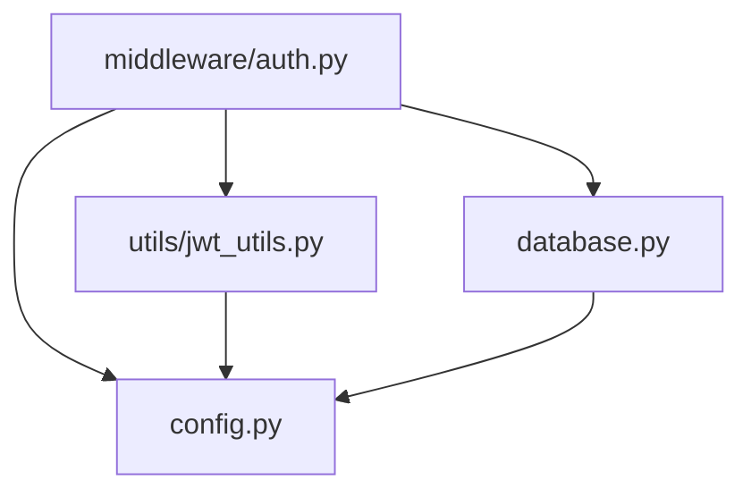
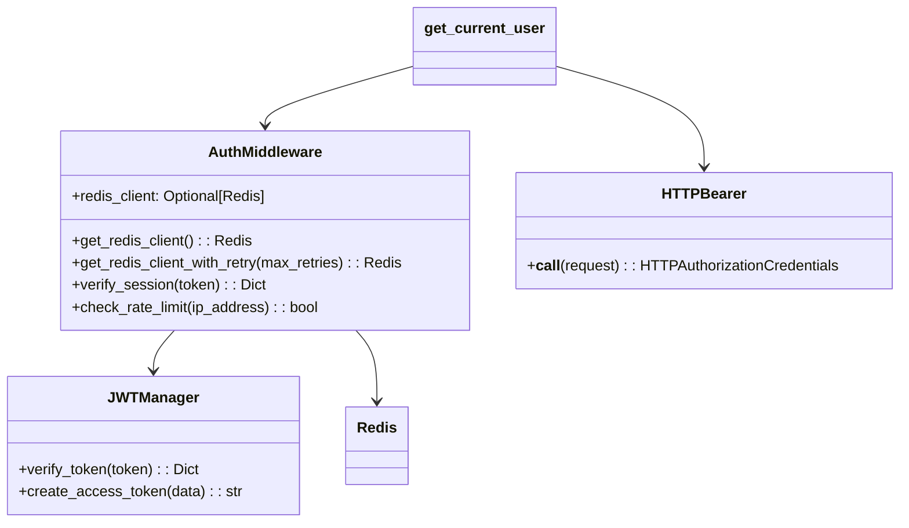

# Auth.py 文件错误修复设计文档

## 项目概述

本文档分析并修复 `middleware/auth.py` 文件中存在的潜在错误和问题。该文件是FastAPI项目中的认证中间件，负责JWT令牌验证、会话管理和用户身份认证。

## 技术栈

- **框架**: FastAPI
- **认证**: JWT (PyJWT)
- **缓存**: Redis
- **语言**: Python 3.8+

## 问题分析

### 1. 潜在的导入问题

从附加的 `auth.py` 文件分析，可能存在以下问题：

#### 导入依赖问题


### 2. Redis连接异常处理不足

当前代码中Redis连接可能存在以下问题：
- Redis客户端初始化失败时缺乏回退机制
- 网络连接异常时的错误处理不完善

### 3. JWT验证异常处理

JWT令牌验证过程中可能出现的异常：
- 令牌格式错误
- 签名验证失败
- 令牌过期

## 修复方案

### 1. 增强Redis连接稳定性

#### 连接池配置
增加Redis连接池配置，提高连接的稳定性和性能：

```python
# 在AuthMiddleware类中增加连接重试机制
async def get_redis_client_with_retry(self, max_retries: int = 3):
    """获取Redis客户端（带重试机制）"""
    for attempt in range(max_retries):
        try:
            if not self.redis_client:
                self.redis_client = get_redis()
            # 测试连接
            self.redis_client.ping()
            return self.redis_client
        except Exception as e:
            logger.warning(f"Redis connection attempt {attempt + 1} failed: {e}")
            if attempt == max_retries - 1:
                raise
            await asyncio.sleep(0.5 * (attempt + 1))
```

### 2. 改进异常处理机制

#### 分级错误处理
实现更细粒度的异常处理：

```python
async def verify_session_enhanced(self, token: str) -> Optional[Dict[str, Any]]:
    """增强的会话验证"""
    try:
        # 1. JWT令牌验证
        payload = JWTManager.verify_token(token)
        if not payload:
            logger.info("JWT token verification failed")
            return None

        # 2. Redis会话检查（带重试）
        redis_client = await self.get_redis_client_with_retry()
        session_key = f"session:{token}"

        try:
            session_data = redis_client.hgetall(session_key)
        except redis.ConnectionError as e:
            logger.error(f"Redis connection error: {e}")
            # 在Redis不可用时，仍允许JWT有效的请求通过
            return {
                "token": token,
                "openid": payload.get("openid"),
                "unionid": payload.get("unionid"),
                "session_data": {},
                "fallback_mode": True
            }

        if not session_data:
            logger.info(f"Session not found in Redis: {session_key}")
            return None

        # 3. 更新用户活跃状态
        await self.update_user_activity(payload.get('openid'), redis_client)

        return {
            "token": token,
            "openid": payload.get("openid"),
            "unionid": payload.get("unionid"),
            "session_data": session_data
        }

    except jwt.ExpiredSignatureError:
        logger.info("JWT token expired")
        return None
    except jwt.InvalidTokenError as e:
        logger.warning(f"Invalid JWT token: {e}")
        return None
    except Exception as e:
        logger.error(f"Unexpected error in session verification: {e}")
        return None
```

### 3. 优化频率限制机制

#### 异步频率限制
改进频率限制的性能和可靠性：

```python
async def check_rate_limit_async(self, ip_address: str) -> Dict[str, Any]:
    """异步频率限制检查"""
    try:
        redis_client = await self.get_redis_client_with_retry()
        rate_limit_key = f"rate_limit:{ip_address}"

        # 使用Redis pipeline提高性能
        pipe = redis_client.pipeline()
        pipe.get(rate_limit_key)
        pipe.ttl(rate_limit_key)
        current_count, ttl = pipe.execute()

        if current_count is None:
            # 第一次请求
            redis_client.setex(rate_limit_key, settings.rate_limit_window, 1)
            return {
                "allowed": True,
                "remaining": settings.login_rate_limit - 1,
                "reset_time": settings.rate_limit_window
            }

        current_count = int(current_count)
        if current_count >= settings.login_rate_limit:
            return {
                "allowed": False,
                "remaining": 0,
                "reset_time": ttl if ttl > 0 else settings.rate_limit_window
            }

        # 增加计数
        redis_client.incr(rate_limit_key)
        return {
            "allowed": True,
            "remaining": settings.login_rate_limit - current_count - 1,
            "reset_time": ttl if ttl > 0 else settings.rate_limit_window
        }

    except Exception as e:
        logger.error(f"Rate limit check failed: {e}")
        # 出错时允许请求，但记录日志
        return {
            "allowed": True,
            "remaining": settings.login_rate_limit,
            "reset_time": settings.rate_limit_window,
            "fallback": True
        }
```

## 具体修复实现

### 1. 导入声明修复

在文件顶部添加缺失的导入：
```python
import asyncio
import redis
from typing import Union
```

### 2. Redis连接稳定性修复

在AuthMiddleware类中添加连接重试机制：
```python
async def get_redis_client_with_retry(self, max_retries: int = 3):
    """获取Redis客户端（带重试机制）"""
    for attempt in range(max_retries):
        try:
            if not self.redis_client:
                self.redis_client = get_redis()
            # 测试连接
            self.redis_client.ping()
            return self.redis_client
        except Exception as e:
            logger.warning(f"Redis connection attempt {attempt + 1} failed: {e}")
            if attempt == max_retries - 1:
                logger.error("Redis connection failed after all retries")
                return None
            await asyncio.sleep(0.5 * (attempt + 1))
    return None
```

### 3. 会话验证异常处理增强

替换现有的verify_session方法：
```python
async def verify_session(self, token: str) -> Optional[Dict[str, Any]]:
    """验证会话（增强版）"""
    try:
        # 验证JWT令牌
        payload = JWTManager.verify_token(token)
        if not payload:
            logger.info("JWT token verification failed")
            return None

        # 获取Redis客户端（带重试）
        redis_client = await self.get_redis_client_with_retry()
        if not redis_client:
            # Redis不可用时的降级处理
            logger.warning("Redis unavailable, using JWT-only verification")
            return {
                "token": token,
                "openid": payload.get("openid"),
                "unionid": payload.get("unionid"),
                "session_data": {},
                "fallback_mode": True
            }

        # 从Redis检查会话
        session_key = f"session:{token}"
        try:
            session_data = redis_client.hgetall(session_key)
        except redis.ConnectionError as e:
            logger.error(f"Redis connection error: {e}")
            # Redis连接错误时的降级处理
            return {
                "token": token,
                "openid": payload.get("openid"),
                "unionid": payload.get("unionid"),
                "session_data": {},
                "fallback_mode": True
            }

        if not session_data:
            logger.info(f"Session not found in Redis: {session_key}")
            return None

        # 更新最后活跃时间
        try:
            user_active_key = f"user:active:{payload.get('openid')}"
            redis_client.setex(
                user_active_key,
                settings.user_active_expire_seconds,
                str(int(datetime.utcnow().timestamp()))
            )
        except Exception as e:
            logger.warning(f"Failed to update user activity: {e}")

        return {
            "token": token,
            "openid": payload.get("openid"),
            "unionid": payload.get("unionid"),
            "session_data": session_data
        }

    except jwt.ExpiredSignatureError:
        logger.info("JWT token expired")
        return None
    except jwt.InvalidTokenError as e:
        logger.warning(f"Invalid JWT token: {e}")
        return None
    except Exception as e:
        logger.error(f"Unexpected error in session verification: {str(e)}")
        return None
```

### 4. 频率限制异步优化

改进check_rate_limit方法：
```python
async def check_rate_limit(self, ip_address: str) -> bool:
    """检查请求频率限制（异步增强版）"""
    try:
        redis_client = await self.get_redis_client_with_retry()
        if not redis_client:
            logger.warning("Redis unavailable for rate limiting, allowing request")
            return True

        rate_limit_key = f"rate_limit:{ip_address}"

        # 使用Redis pipeline提高性能
        pipe = redis_client.pipeline()
        pipe.get(rate_limit_key)
        pipe.ttl(rate_limit_key)

        try:
            current_count, ttl = pipe.execute()
        except redis.ConnectionError as e:
            logger.error(f"Redis pipeline execution failed: {e}")
            return True  # Redis错误时允许请求

        if current_count is None:
            redis_client.setex(rate_limit_key, settings.rate_limit_window, 1)
            return True

        if int(current_count) >= settings.login_rate_limit:
            logger.warning(f"Rate limit exceeded for IP: {ip_address}")
            return False

        redis_client.incr(rate_limit_key)
        return True

    except Exception as e:
        logger.error(f"Rate limit check failed: {str(e)}")
        return True  # 出错时允许请求
```

### 5. 依赖注入函数改进

优化get_current_user函数的错误处理：
```python
async def get_current_user(
    credentials: HTTPAuthorizationCredentials = Depends(security)
) -> Dict[str, Any]:
    """获取当前用户信息（依赖注入）- 增强版"""
    if not credentials or not credentials.credentials:
        raise HTTPException(
            status_code=status.HTTP_401_UNAUTHORIZED,
            detail="Missing authorization credentials",
            headers={"WWW-Authenticate": "Bearer"},
        )

    try:
        session_info = await auth_middleware.verify_session(credentials.credentials)
        if not session_info:
            raise HTTPException(
                status_code=status.HTTP_401_UNAUTHORIZED,
                detail="Invalid or expired token",
                headers={"WWW-Authenticate": "Bearer"},
            )

        return session_info

    except HTTPException:
        raise  # 重新抛出HTTP异常
    except Exception as e:
        logger.error(f"Unexpected error in get_current_user: {str(e)}")
        raise HTTPException(
            status_code=status.HTTP_500_INTERNAL_SERVER_ERROR,
            detail="Internal authentication error"
        )
```

## 监控与日志

### 日志增强
```python
# 添加结构化日志
import structlog

logger = structlog.get_logger(__name__)

# 在关键位置添加详细日志
logger.info("auth_verification_started",
           token_prefix=token[:10] if token else None,
           ip_address=get_client_ip(request))
```

### 性能监控
```python
# 添加性能监控点
import time

async def verify_session_with_metrics(self, token: str):
    start_time = time.time()
    try:
        result = await self.verify_session_enhanced(token)
        duration = time.time() - start_time
        logger.info("auth_verification_completed",
                   duration=duration,
                   success=result is not None)
        return result
    except Exception as e:
        duration = time.time() - start_time
        logger.error("auth_verification_failed",
                    duration=duration,
                    error=str(e))
        raise
```

## 修复后的完整文件结构

修复后的 `middleware/auth.py` 文件应包含以下关键组件：



### 关键修改点总结

1. **导入增强**: 添加 `asyncio`, `redis`, `jwt` 模块导入
2. **连接稳定性**: Redis连接重试机制
3. **异常处理**: 分层异常处理和降级策略
4. **性能优化**: Redis pipeline和异步操作
5. **日志改进**: 结构化日志和错误跟踪

## 部署与验证

### 1. 修复验证步骤

```bash
# 1. 语法检查
python -m py_compile middleware/auth.py

# 2. 导入测试
python -c "from middleware.auth import AuthMiddleware, get_current_user"

# 3. 运行导入验证脚本
python test_imports.py

# 4. 运行单元测试
pytest tests/test_auth_middleware.py -v
```

### 2. 配置验证

确保以下配置项在 `.env` 文件中正确设置：
```bash
# Redis配置
REDIS_HOST=localhost
REDIS_PORT=6379
REDIS_DB=0
REDIS_PASSWORD=  # 可选

# JWT配置
JWT_SECRET_KEY=your_jwt_secret_key_change_in_production
JWT_ALGORITHM=HS256
JWT_EXPIRE_MINUTES=120

# 安全配置
LOGIN_RATE_LIMIT=10
RATE_LIMIT_WINDOW=3600
```

### 3. 健康检查

添加认证中间件健康检查端点：
```python
@app.get("/health/auth")
async def auth_health_check():
    """认证系统健康检查"""
    try:
        # 检查Redis连接
        redis_client = await auth_middleware.get_redis_client_with_retry()
        redis_status = "healthy" if redis_client else "unhealthy"

        # 检查JWT配置
        jwt_config_status = "healthy" if settings.jwt_secret_key != "your_jwt_secret_key_change_in_production" else "warning"

        return {
            "status": "healthy",
            "redis": redis_status,
            "jwt_config": jwt_config_status,
            "timestamp": datetime.utcnow().isoformat()
        }
    except Exception as e:
        return {
            "status": "unhealthy",
            "error": str(e),
            "timestamp": datetime.utcnow().isoformat()
        }
```
