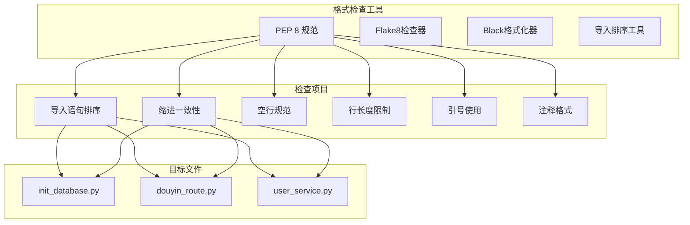
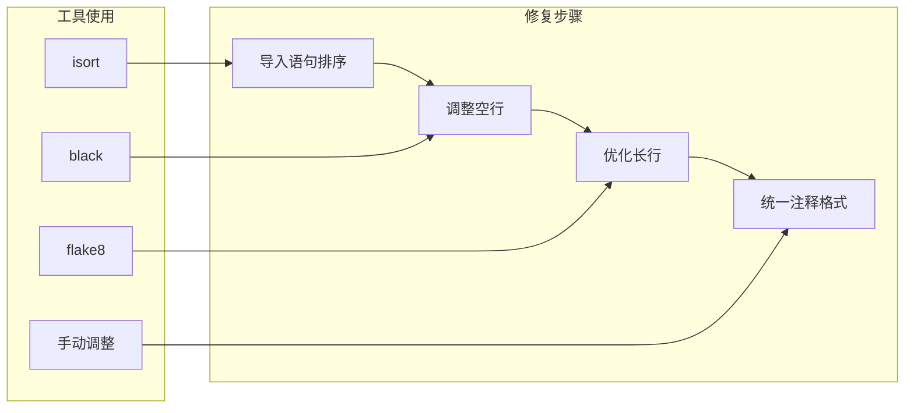

# Python文件格式问题修复设计

## 概述

本设计文档针对dyxr项目中3个Python文件的格式问题进行分析和修复：
- `scripts/init_database.py`
- `routes/douyin_route.py`  
- `services/user_service.py`

项目采用FastAPI框架，遵循PEP 8 Python代码规范。需要确保代码格式的一致性和可读性。

## 文件格式检查架构



## 格式问题分析

### 1. 导入语句规范问题

根据PEP 8规范，导入语句应按以下顺序排列：
1. 标准库导入
2. 相关第三方库导入
3. 本地应用/库导入

**问题识别**：
- 检查导入语句是否按正确顺序排列
- 验证是否有未使用的导入
- 确认相对导入和绝对导入的使用

### 2. 代码缩进和空行规范

**PEP 8要求**：
- 使用4个空格进行缩进
- 类定义前后应有2个空行
- 函数定义前后应有1个空行（类内部）或2个空行（顶级）
- 逻辑段落间适当使用空行分隔

### 3. 行长度限制

**规范要求**：
- 每行代码不应超过79字符
- 文档字符串和注释不应超过72字符

### 4. 字符串引号使用

**一致性要求**：
- 在同一项目中保持字符串引号使用的一致性
- 优先使用双引号（与项目现有风格保持一致）

### 5. 注释格式规范

**PEP 8要求**：
- 行内注释前应有至少2个空格
- `#` 后应有一个空格
- 文档字符串应使用三重双引号

## 具体文件问题修复

### scripts/init_database.py

**问题分析**：
1. 文件开头的shebang行格式正确
2. 导入语句需要重新排序
3. 函数间空行规范需要调整
4. 长字符串可能需要适当换行

**修复方案**：



### routes/douyin_route.py

**问题分析**：
1. FastAPI路由文件，包含大量API端点定义
2. 导入语句较多，需要合理分组
3. 函数定义的空行规范
4. 长参数列表的格式化

**修复重点**：
- 导入语句按标准库、FastAPI相关、项目内部模块分组
- API端点函数间保持适当空行
- 长参数列表使用适当的换行和缩进

### services/user_service.py

**问题分析**：
1. 业务逻辑文件，包含UserService类
2. 方法较多，需要规范的空行分隔
3. 文档字符串格式需要统一
4. 异常处理代码的格式化

**修复重点**：
- 类和方法的空行规范
- 文档字符串格式统一
- 长方法的逻辑分组和空行使用

## 格式修复标准

### 导入语句标准格式

```python
#!/usr/bin/env python3
# -*- coding: utf-8 -*-
"""
模块文档字符串
"""

# 标准库导入
import logging
import sys
import os
from datetime import datetime
from typing import Optional, List, Dict, Any

# 第三方库导入
from fastapi import APIRouter, Depends, HTTPException
from sqlalchemy.orm import Session
from sqlalchemy import text, create_engine

# 项目内部导入
from database import engine, Base, SessionLocal
from models.userModel import User
from schemas.userSche import UserCreate
from services.session_service import session_manager
```

### 类和函数定义格式

```python
class UserService:
    """用户管理服务类"""
    
    def __init__(self):
        """初始化用户服务"""
        pass
    
    def get_user_by_openid(self, db: Session, openid: str) -> Optional[User]:
        """
        根据openid获取用户
        
        Args:
            db: 数据库会话
            openid: 用户openid
            
        Returns:
            用户对象或None
        """
        try:
            return db.query(User).filter(User.openid == openid).first()
        except Exception as e:
            logger.error(f"Failed to get user by openid: {str(e)}")
            return None


def standalone_function():
    """独立函数示例"""
    pass
```

### API路由格式

```python
@router.post(
    "/apps/login", 
    response_model=DouyinLoginResponse, 
    summary="抖音小程序登录"
)
async def douyin_mini_app_login(
    request: Request,
    login_data: DouyinLoginRequest,
    db: Session = Depends(get_db)
):
    """
    抖音小程序登录接口
    
    Args:
        request: HTTP请求对象
        login_data: 登录数据
        db: 数据库会话
        
    Returns:
        登录响应数据
    """
    try:
        # 业务逻辑
        pass
    except HTTPException:
        raise
    except Exception as e:
        logger.error(f"Login endpoint error: {str(e)}")
        raise HTTPException(
            status_code=status.HTTP_500_INTERNAL_SERVER_ERROR,
            detail="登录服务暂时不可用"
        )
```

## 自动化格式化工具配置

### Black配置
```toml
[tool.black]
line-length = 79
target-version = ['py38']
include = '\.pyi?$'
extend-exclude = '''
/(
  # 排除的目录
  __pycache__
  | \.git
  | \.venv
  | build
  | dist
)/
'''
```

### isort配置
```toml
[tool.isort]
profile = "black"
multi_line_output = 3
line_length = 79
known_first_party = ["models", "schemas", "services", "routes", "utils"]
known_third_party = ["fastapi", "sqlalchemy", "pydantic", "redis", "pymongo"]
sections = ["FUTURE", "STDLIB", "THIRDPARTY", "FIRSTPARTY", "LOCALFOLDER"]
```

### flake8配置
```ini
[flake8]
max-line-length = 79
extend-ignore = E203, W503
exclude = 
    __pycache__,
    .git,
    .venv,
    build,
    dist
```

## 修复实施计划

### 阶段1：自动化格式修复
1. 运行isort对导入语句排序
2. 运行black进行代码格式化
3. 运行flake8检查剩余问题

### 阶段2：手动格式调整
1. 调整文档字符串格式
2. 优化注释排版
3. 检查和修复特殊格式问题

### 阶段3：验证和测试
1. 运行项目测试确保功能正常
2. 检查格式化后的代码可读性
3. 确认符合项目代码规范

## 质量保证

### 持续集成检查
```yaml
# .github/workflows/code-quality.yml
name: Code Quality
on: [push, pull_request]
jobs:
  lint:
    runs-on: ubuntu-latest
    steps:
      - uses: actions/checkout@v2
      - name: Set up Python
        uses: actions/setup-python@v2
        with:
          python-version: 3.8
      - name: Install dependencies
        run: |
          pip install black isort flake8
      - name: Check formatting
        run: |
          black --check .
          isort --check-only .
          flake8 .
```

### 预提交钩子
```yaml
# .pre-commit-config.yaml
repos:
  - repo: https://github.com/psf/black
    rev: 22.3.0
    hooks:
      - id: black
        language_version: python3
  
  - repo: https://github.com/PyCQA/isort
    rev: 5.10.1
    hooks:
      - id: isort
  
  - repo: https://github.com/PyCQA/flake8
    rev: 4.0.1
    hooks:
      - id: flake8
```

通过这些格式修复措施，可以确保Python代码符合PEP 8规范，提高代码质量和可维护性。