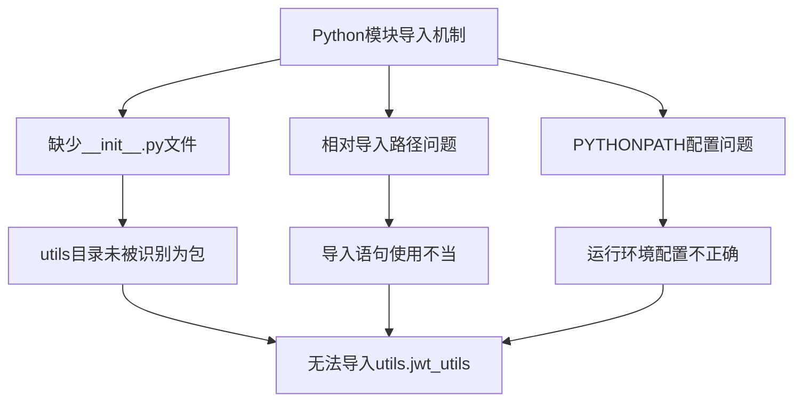
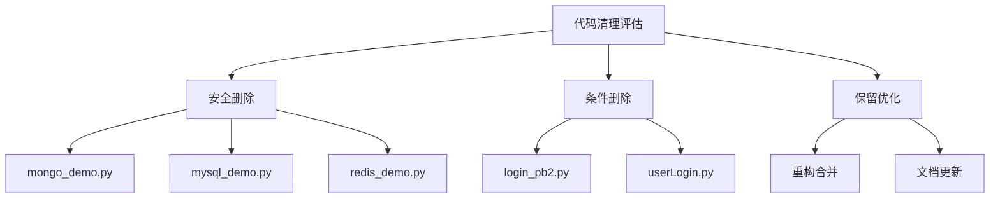
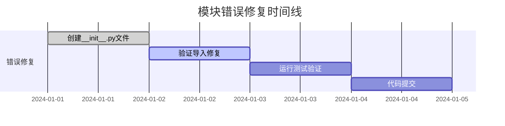

# 模块错误修复和代码清理设计文档

## 概述

本文档针对dyxr项目中的模块导入错误和代码冗余问题，提出系统性的修复和清理方案。主要解决`ModuleNotFoundError: No module named 'utils.jwt_utils'`错误，并对项目进行精简优化。

## 问题分析

### 1. 模块导入错误分析

#### 错误现象
```
ModuleNotFoundError: No module named 'utils.jwt_utils'
```

#### 根本原因


#### 影响范围
- `routes/douyin_route.py`: 导入 `mask_sensitive_data`
- `services/douyin_login_service.py`: 导入 `create_session_token, mask_sensitive_data`
- `tests/test_jwt_utils.py`: 导入 `JWTManager, create_session_token, mask_sensitive_data`

### 2. 冗余代码识别

通过分析项目结构，识别出以下冗余组件：

| 文件类型 | 文件名 | 冗余原因 | 影响评估 |
|---------|--------|----------|----------|
| 演示服务 | `services/mongo_demo.py` | 仅为演示MongoDB操作 | 低风险删除 |
| 演示服务 | `services/mysql_demo.py` | 仅为演示MySQL操作 | 低风险删除 |
| 演示服务 | `services/redis_demo.py` | 仅为演示Redis操作 | 低风险删除 |
| 协议文件 | `models/login_pb2.py` | protobuf生成文件，未被使用 | 中风险删除 |
| 重复功能 | `services/userLogin.py` | 功能被`user_service.py`替代 | 需检查依赖 |

## 修复方案

### 1. 模块导入错误修复

#### 方案A: 添加__init__.py文件（推荐）


**实施步骤:**
1. 在`utils/`目录下创建空的`__init__.py`文件
2. 验证导入是否正常工作
3. 运行测试确保功能完整

#### 方案B: 修改导入语句
```python
# 当前问题导入
from utils.jwt_utils import mask_sensitive_data

# 修复后导入（相对导入）
from ..utils.jwt_utils import mask_sensitive_data

# 或使用绝对导入
import sys
import os
sys.path.append(os.path.dirname(os.path.dirname(__file__)))
from utils.jwt_utils import mask_sensitive_data
```

### 2. 代码清理策略

#### 删除策略表


#### 删除优先级

**第一阶段: 安全删除（无依赖风险）**
1. `services/mongo_demo.py` - MongoDB演示代码
2. `services/mysql_demo.py` - MySQL演示代码
3. `services/redis_demo.py` - Redis演示代码

**第二阶段: 条件删除（需验证依赖）**
1. `models/login_pb2.py` - protobuf文件（需确认无导入）
2. `services/userLogin.py` - 检查是否被`userRoute.py`使用

**第三阶段: 优化保留**
1. 合并重复的工具函数
2. 清理未使用的导入语句
3. 更新相关文档

## 实施计划

### 阶段1: 错误修复（优先级最高）



**具体任务:**
1. 在`utils/`目录创建`__init__.py`文件
2. 在`models/`、`services/`、`routes/`、`schemas/`目录检查并创建缺失的`__init__.py`
3. 验证所有模块导入正常
4. 运行现有测试确保功能完整

### 阶段2: 代码清理（优先级中等）

**安全删除任务:**
1. 删除`services/mongo_demo.py`
2. 删除`services/mysql_demo.py`
3. 删除`services/redis_demo.py`
4. 从路由中移除相关引用（如果存在）

**依赖检查任务:**
1. 分析`models/login_pb2.py`的使用情况
2. 检查`services/userLogin.py`是否被引用
3. 确认删除安全性

### 阶段3: 优化整理（优先级低）

**代码优化:**
1. 清理未使用的导入语句
2. 统一错误处理方式
3. 优化日志输出格式
4. 更新项目文档

## 验证测试

### 1. 模块导入测试
```python
# 测试脚本: test_imports.py
def test_utils_import():
    """测试utils模块导入"""
    try:
        from utils.jwt_utils import JWTManager, create_session_token
        print("✓ utils.jwt_utils 导入成功")
        return True
    except ImportError as e:
        print(f"✗ utils.jwt_utils 导入失败: {e}")
        return False

def test_all_modules():
    """测试所有模块导入"""
    modules = [
        'utils.jwt_utils',
        'utils.http_utils',
        'services.douyin_login_service',
        'routes.douyin_route'
    ]

    for module in modules:
        try:
            __import__(module)
            print(f"✓ {module} 导入成功")
        except ImportError as e:
            print(f"✗ {module} 导入失败: {e}")
```

### 2. 功能回归测试
```bash
# 运行现有测试套件
python -m pytest tests/ -v

# 测试特定功能
python -m pytest tests/test_jwt_utils.py -v

# 检查服务启动
python main.py
```

### 3. API接口测试
```bash
# 健康检查
curl http://localhost:8000/health

# 测试JWT相关接口
curl -X POST http://localhost:8000/users/apps/login \
  -H "Content-Type: application/json" \
  -d '{"code": "test_code"}'
```

## 风险评估与预案

### 风险矩阵

| 风险类型 | 概率 | 影响 | 缓解措施 |
|---------|------|------|----------|
| 模块导入失败 | 低 | 高 | 创建完整的__init__.py文件 |
| 删除文件影响功能 | 中 | 中 | 分阶段删除，充分测试 |
| 测试失败 | 低 | 中 | 保留原文件备份 |
| 服务启动失败 | 低 | 高 | 逐步验证，回滚机制 |

### 回滚预案
1. **备份策略**: 修改前创建完整项目备份
2. **版本控制**: 每个阶段单独提交，便于回滚
3. **监控机制**: 实时监控服务状态和错误日志
4. **快速恢复**: 准备快速恢复脚本和配置

## 后期维护

### 1. 代码规范
- 统一模块导入方式
- 建立代码审查检查清单
- 定期清理无用代码

### 2. 监控机制
- 添加模块导入监控
- 建立代码质量度量
- 定期依赖分析报告

### 3. 文档更新
- 更新项目架构图
- 维护模块依赖关系文档
- 编写开发规范指南
